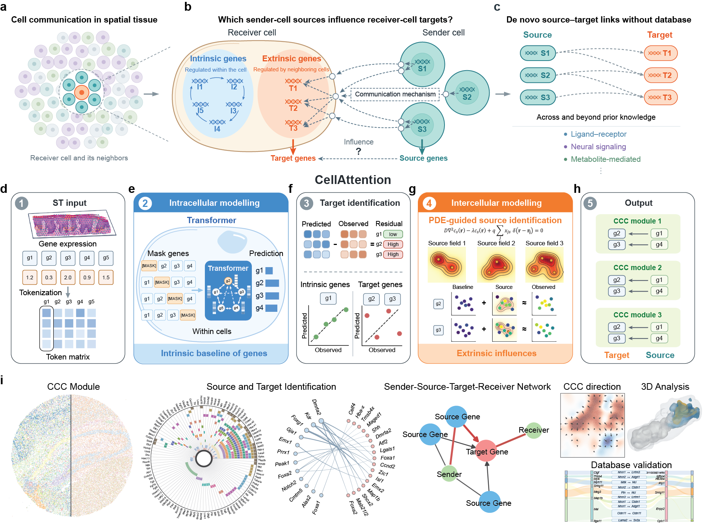

# CellAttention

CellAttention learns an intracellular expression baseline with a masked-gene Transformer, then uses spatial reaction–diffusion fields to identify receiver-group-specific source–target gene relations.



## Rust core programs

Build the CPU binaries from the repository root:

```bash
cargo build --release --locked --bins
```

For CUDA training, build the training binary with:

```bash
cargo build --release --locked --no-default-features --features cuda --bin cell_attention
```

The programs read JSON configuration files. Input expression is a numeric cell-by-gene CSV or Matrix Market file. `cell_ids.txt` and `gene_ids.txt` contain one ID per line in matrix order. Spatial coordinates are a headerless CSV with one row per cell and two or three columns.

### 1. Train the Transformer

Save a training configuration such as `.local/example/train.json`, replacing the input paths with your files:

```json
{
  "expression_matrix": "/path/to/expression.mtx",
  "cell_ids": "/path/to/cell_ids.txt",
  "gene_ids": "/path/to/gene_ids.txt",
  "output_dir": ".local/example/model",
  "device_index": 0,
  "model": {
    "d_model": 48,
    "d_ff": 96,
    "n_heads": 4,
    "n_layers": 2,
    "dropout": 0.05
  },
  "training": {
    "epochs": 60,
    "batch_size": 128,
    "learning_rate": 0.001,
    "mask_probability": 0.25,
    "seed": 168
  }
}
```

```bash
target/release/cell_attention .local/example/train.json
```

The output directory contains `model.mpk`, the aligned IDs, `raw_expression.csv`, `residuals.csv`, and `cell_embeddings.csv`. Add `"sample_ids": "/path/to/sample_ids.txt"` when training across samples; the file has one sample ID per cell.

### 2. Infer spatial source–target relations

Save an analysis configuration such as `.local/example/analysis.json`:

```json
{
  "dataset": "example",
  "checkpoint_dir": ".local/example/model",
  "coordinates": "/path/to/spatial_coordinates.csv",
  "output_dir": ".local/example/analysis",
  "embedding_dimensions": 48,
  "receiver_group_count": 8,
  "maximum_fit_cells": 10000,
  "length_scale": 50.0,
  "maximum_distance": 150.0,
  "minimum_distance": 2.0
}
```

```bash
target/release/run_source_target_analysis .local/example/analysis.json
```

Set `embedding_dimensions` to the model's `d_model`. Choose the spatial distances in the coordinate units of your data. For 3D coordinates, add `"coordinate_dimensions": 3`. The analysis writes `receiver_group_assignments.csv`, `target_scores.csv`, and `source_target_scores.csv` to its output directory.

| Additional program | Run | Output |
| --- | --- | --- |
| `select_receiver_group_count` | `target/release/select_receiver_group_count CONFIG.json` | Spatial cross-validation scores for candidate receiver-group counts |
| `export_cell_cell_interactions` | `target/release/export_cell_cell_interactions CONFIG.json` | Sender–receiver cell edges for selected source–target relations |
| `validate_selected_triplets` | `target/release/validate_selected_triplets CONFIG.json` | Spatial holdout and stability results for selected relations |
| `export_checkpoint_matrices` | `target/release/export_checkpoint_matrices TRAIN_CONFIG.json CHECKPOINT_DIR --inputs-only` | Regenerate `raw_expression.csv` and `standardized_expression.csv` from the preprocessed matrix |

Omit `--inputs-only` to also infer `reconstruction.csv`, `residuals.csv`, and `cell_embeddings.csv` from `model.mpk`.

## Reproduction data

The [CellAttention paper dataset on Zenodo](https://doi.org/10.5281/zenodo.23173939) contains preprocessed inputs, training and analysis configurations, and trained models for the synthetic, spatial CRISPR, Xenium liver, Slide-seqV2, MOSTA, and 3D weMERFISH workflows. Download and extract the archive for a dataset, then follow the README inside it to restore expression CSV files and run the analysis.

## Dataset workflows

[synthetic](experiments/synthetic/README.md) · [benchmark](experiments/benchmark/README.md) · [spatial CRISPR](experiments/crispr/README.md) · [Xenium liver](experiments/xenium/README.md) · [Slide-seqV2 hippocampus](experiments/slideseqv2/README.md) · [MOSTA](experiments/mosta/README.md) · [3D weMERFISH](experiments/merfish/README.md)
