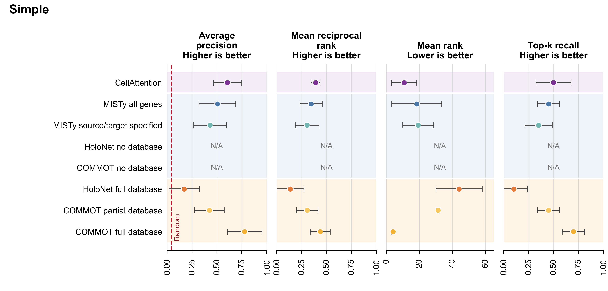
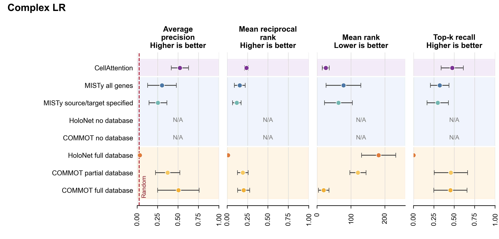
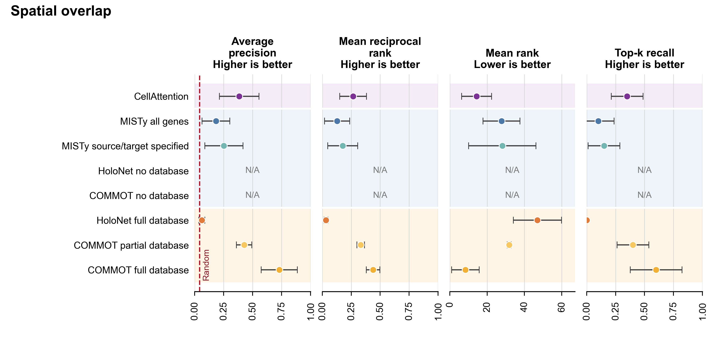

# External-method benchmark

Reproduces Fig. 2e–f across the `simple`, `complex_lr`, and `spatial_overlap` synthetic scenarios. Requires Rust/Cargo and `micromamba`.

From the repository root:

```bash
python3 experiments/benchmark/run.py setup
python3 experiments/benchmark/run.py all
```

The stages are `generate`, `train`, `methods`, `evaluate`, and `visualize`. Generation uses seeds 168–172; CellAttention training uses seeds 3001–3005 for each dataset. The comparison includes HoloNet, COMMOT with partial and full ligand–receptor priors, and MISTy with specified or unrestricted gene roles.

The workflow writes generated data, model checkpoints, method outputs, metric tables, and PNG/PDF figures to `.local/benchmark/`.

## Example figures

**Benchmark metrics for the simple scenario**



Run from the repository root after `methods`; `evaluate` writes `.local/benchmark/visualization/supp_figures/simple/benchmark_metrics.png`:

```bash
python3 experiments/benchmark/run.py evaluate
```

**Benchmark metrics for the complex ligand–receptor scenario**



The same `evaluate` stage writes `.local/benchmark/visualization/supp_figures/complex_lr/benchmark_metrics.png`:

```bash
python3 experiments/benchmark/run.py evaluate
```

**Benchmark metrics for the spatial-overlap scenario**



The same `evaluate` stage writes `.local/benchmark/visualization/supp_figures/spatial_overlap/benchmark_metrics.png`:

```bash
python3 experiments/benchmark/run.py evaluate
```
