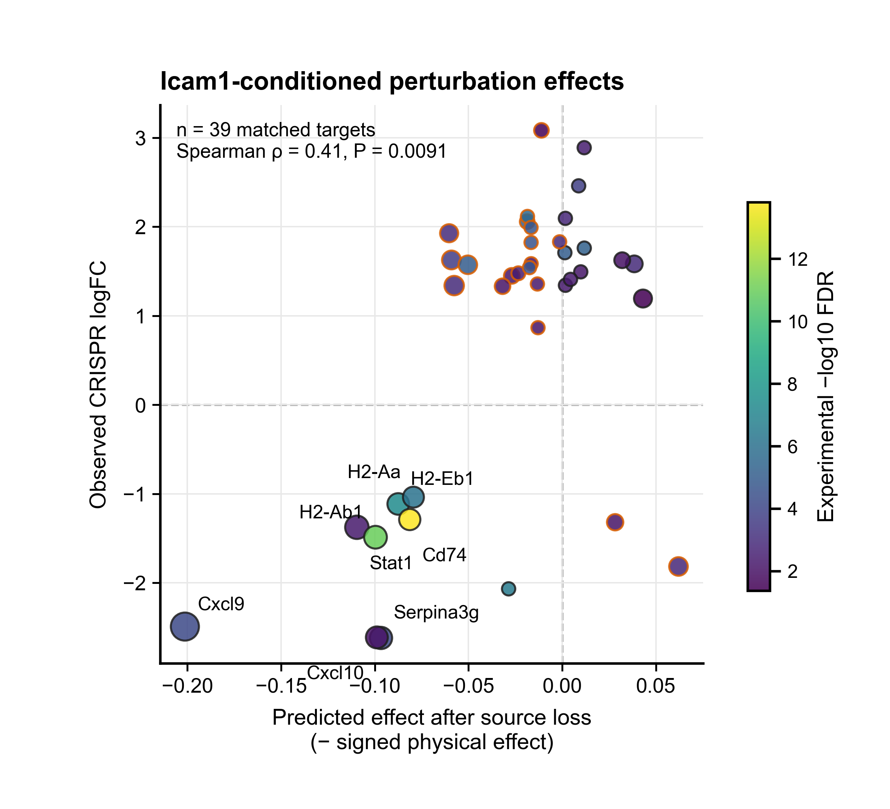

# Spatial CRISPR validation

Uses the SPAC-seq mouse lung-metastasis dataset to reproduce the immune-cell source–target analysis and perturbation comparison. The inputs are `SpacSeq_lung_cancer_label.h5ad` and its marker spreadsheet `1-s2.0-S0092867426005167-mmc12.xlsx`.

From the repository root:

```bash
python3 -m venv .local/crispr-venv
source .local/crispr-venv/bin/activate
python -m pip install -r experiments/crispr/requirements.txt
python experiments/crispr/run.py all \
  --raw-h5ad /path/to/SpacSeq_lung_cancer_label.h5ad \
  --marker-xlsx /path/to/1-s2.0-S0092867426005167-mmc12.xlsx
```

The stages are `prepare`, `train`, `analyze`, `validate`, and `plot`. `prepare` selects the 500-gene panel and computes differential expression between each gene-specific shape and the non-targeting control shape in immune cells. `train` fits the control-region Transformer with seed 168 for 200 epochs. `analyze` fits 12 receiver groups and source–target effects. `validate` compares them with perturbation differential expression. `plot` writes the main and supplementary PNG/PDF figures.

Preprocessed data, checkpoints, analysis tables, and figures are written under `.local/crispr/`. To use existing differential-expression tables, pass `--dge-all` and `--dge-significant`.

## Example figure

**Predicted Icam1 effect and measured CRISPR effect**



Run from the repository root after `validate`; this writes `.local/crispr/visualization/figures/Icam1_predicted_vs_crispr_effect.png`:

```bash
python experiments/crispr/run.py plot
```
