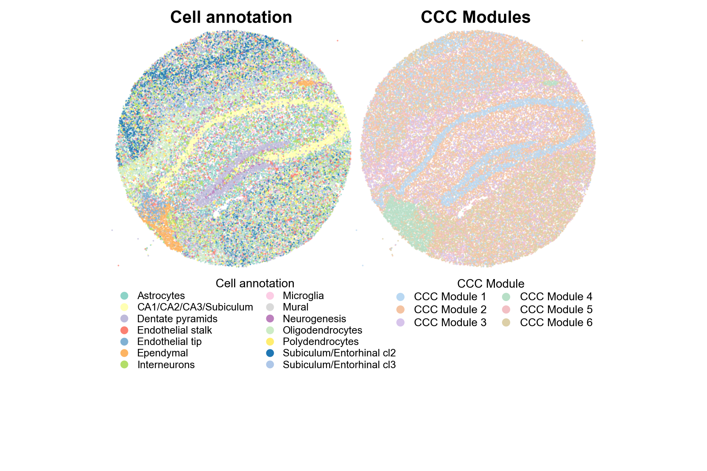
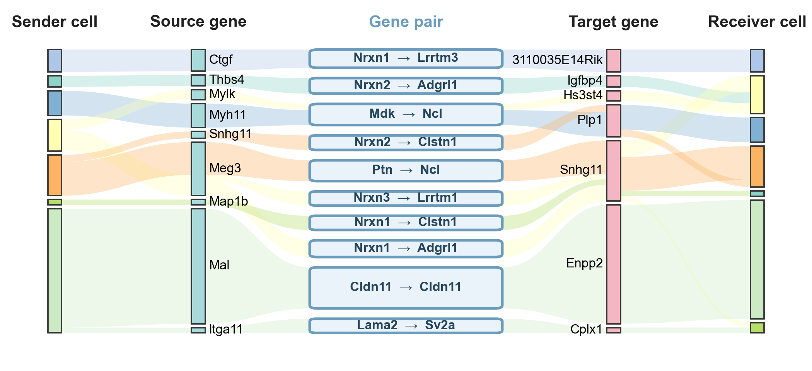
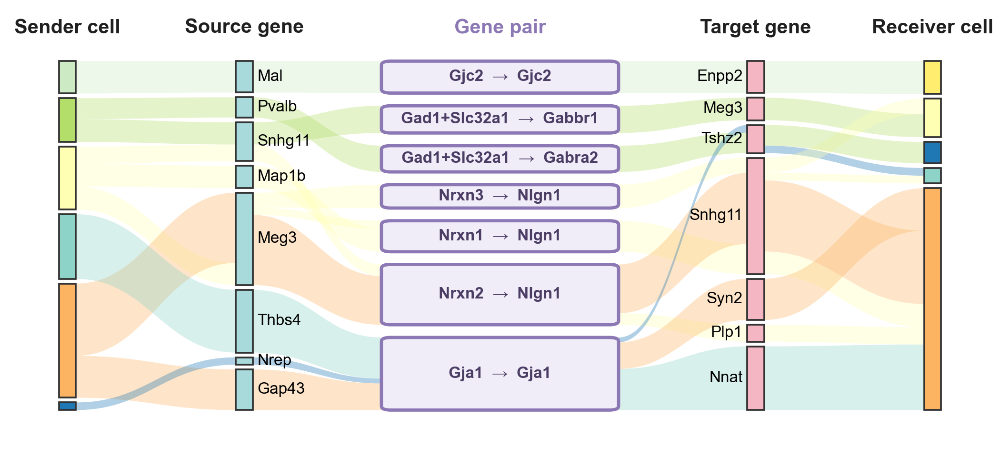
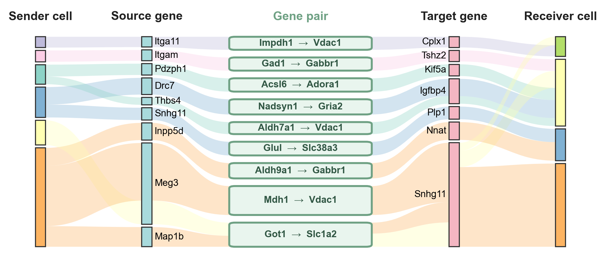
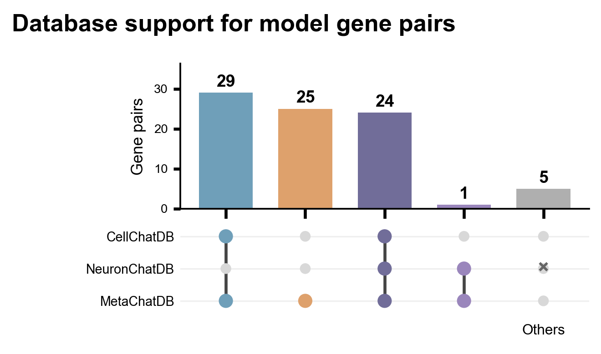

# Slide-seqV2 mouse hippocampus

This workflow uses the annotated Slide-seqV2 hippocampus H5AD (41,786 beads, 23,264 genes), selects a fixed 500-gene panel, trains CellAttention, and evaluates source–target relations against CellChatDB, NeuronChatDB, and MetaChatDB. The CellChat ligand–receptor table is used for panel selection; the three compact relation tables in `database_relations/` are used for validation.

The aligned H5AD combines whole-transcriptome counts from [SCP815](https://singlecell.broadinstitute.org/single_cell/study/SCP815) with the cell-type annotations provided by [Squidpy Slide-seqV2](https://squidpy.readthedocs.io/en/stable/notebooks/tutorials/tutorial_slideseqv2.html).

From the repository root, install the Python packages and run:

```bash
python3 -m venv .local/slideseqv2-venv
source .local/slideseqv2-venv/bin/activate
python -m pip install -r experiments/slideseqv2/requirements.txt
python experiments/slideseqv2/run.py all \
  --raw-h5ad /path/to/adata_raw_labeled.h5ad \
  --cellchat-db /path/to/LR.Mouse_LR.txt
```

The stages can also be called separately: `prepare`, `train`, `groups`, `analyze`, `edges`, `databases`, and `plot`. The stages write preprocessed inputs to `.local/slideseqv2/data/preprocessed/`, the model to `.local/slideseqv2/model/transformer/`, analysis tables to `.local/slideseqv2/analysis/`, and figures to `.local/slideseqv2/visualization/figures/`. Training uses 60 epochs and seed 168. To use a trained model, add `--checkpoint-dir /path/to/model/transformer`.

`plot` produces PNG and PDF versions of:

- the compact annotation and CCC-module map;
- the six-module source–target relation figure;
- the gene-pair database-support UpSet plot;
- three database-pair Sankey figures;
- six single-case and three combined spatial-streamline figures;
- three supplementary source–database-pair–target diagrams.

## Example figures

**Slide-seqV2 cell annotations and CCC modules**



Run from the repository root after `databases`; this writes `.local/slideseqv2/visualization/figures/slideseq_annotation_clusters_compact.png`:

```bash
python experiments/slideseqv2/run.py plot
```

**Protein-signaling database-pair Sankey**



The same plotting stage writes `.local/slideseqv2/visualization/figures/database_pair_sankey/protein_signaling_model_database_pair_sankey.png`:

```bash
python experiments/slideseqv2/run.py plot
```

**Neural-signaling database-pair Sankey**



The same plotting stage writes `.local/slideseqv2/visualization/figures/database_pair_sankey/neural_signaling_model_database_pair_sankey.png`:

```bash
python experiments/slideseqv2/run.py plot
```

**Metabolite-signaling database-pair Sankey**



The same plotting stage writes `.local/slideseqv2/visualization/figures/database_pair_sankey/metabolite_signaling_model_database_pair_sankey.png`:

```bash
python experiments/slideseqv2/run.py plot
```

**Database support for gene pairs**



The same plotting stage writes `.local/slideseqv2/visualization/figures/database_support_gene_pair_upset.png`:

```bash
python experiments/slideseqv2/run.py plot
```
