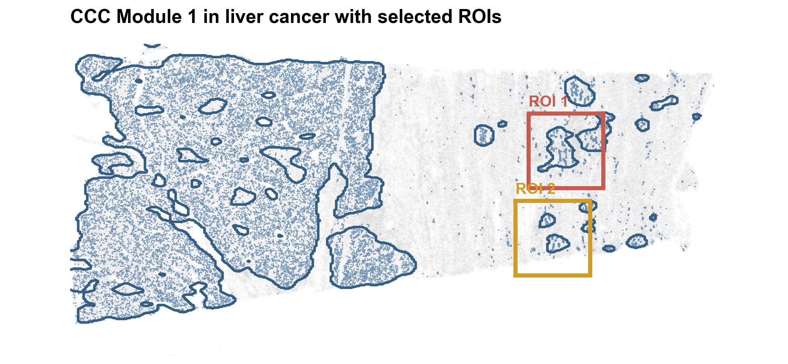
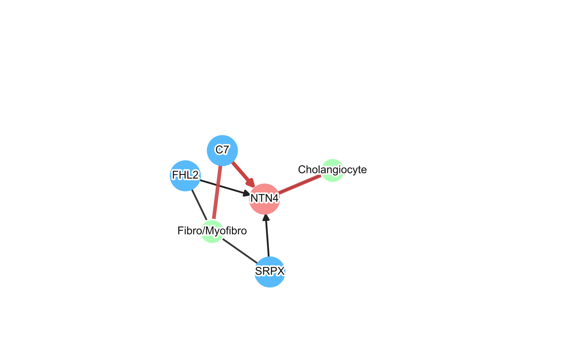

# Xenium liver

The workflow combines non-diseased and liver-cancer Xenium samples (401,899 cells; 377 genes), trains a Transformer with seed 168 for 200 epochs, and fits ten receiver groups for spatial source–target analysis.

Install Python dependencies from the repository root:

```bash
python3 -m venv .local/xenium-venv
source .local/xenium-venv/bin/activate
python -m pip install -r experiments/xenium/requirements.txt
```

The raw directory must contain `cell_name.txt`, `gene_list.txt`, `annotation.csv`, `gene_expression.npz`, and `spatial_coordinates.npy`. Run:

```bash
python experiments/xenium/run.py prepare --raw-dir /path/to/xenium/raw
python experiments/xenium/run.py annotate
python experiments/xenium/run.py train
python experiments/xenium/run.py analyze
python experiments/xenium/run.py plot
```

`prepare` and `annotate` write the aligned expression, coordinates, and cell annotations to `.local/xenium/data/preprocessed/`. `train` writes the model to `.local/xenium/model/transformer/`. `analyze` writes receiver groups and source–target scores to `.local/xenium/analysis/results/`. `plot` writes the CCC Module 1 ROI map and C7–NTN4 network to `.local/xenium/visualization/figures/`.

To use a trained model, run `analyze --checkpoint-dir /path/to/model/transformer`.

## Example figures

**CCC Module 1 and its selected regions of interest**



Run from the repository root after `analyze`; this uses the included ROI selection table and writes `.local/xenium/visualization/figures/cluster_1_overview.png`:

```bash
python experiments/xenium/run.py plot
```

**Receiver-anchored cell type → source gene → target gene → cell type network**



The same plotting stage uses the included C7–NTN4 ROI relation table and writes `.local/xenium/visualization/figures/cluster_1_C7_to_NTN4_roi_network.png`:

```bash
python experiments/xenium/run.py plot
```
